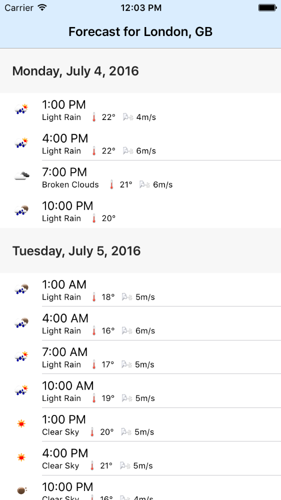

# Weather

An Swift iOS 9 iPhone app developed in ~4 hours that connects to OpenWeatherMap and displays the 5 day weather forecast for London, GB.

## How to Run, Build and Test

The project can be run using Xcode 7.3 and built/tested using the standard Xcode build (⌘B) and test (⌘U) commands.

## Further Improvements

The following are some of the improvements to the project that should be made given more time:

- Location should use the devices current location instead of the hardcoded test location (London, GB)
- Refresh button to manually trigger updating of weather data
- Mock API endpoint that loads test responses from JSON files in test bundle to remove the dependency of the life API during testing
- Custom Forecast cell for more advanced layout of forecast information
- Parse and show more forecast info such as wind direction and humidity
- "View model" for Forecast object to handle transforming raw data into strings and other structures for user display to better test data presented in view controllers
- Extract weather data into Core Data attributes instead of just storing raw JSON response
- More unit tests for more complete coverage, including for DayIdentifier, NSDateExtension, FetchableManagedObject, ConcurrentOperation
- UI tests
- Use reachability to handle various network conditions
- Better management of API requests and data fetching
